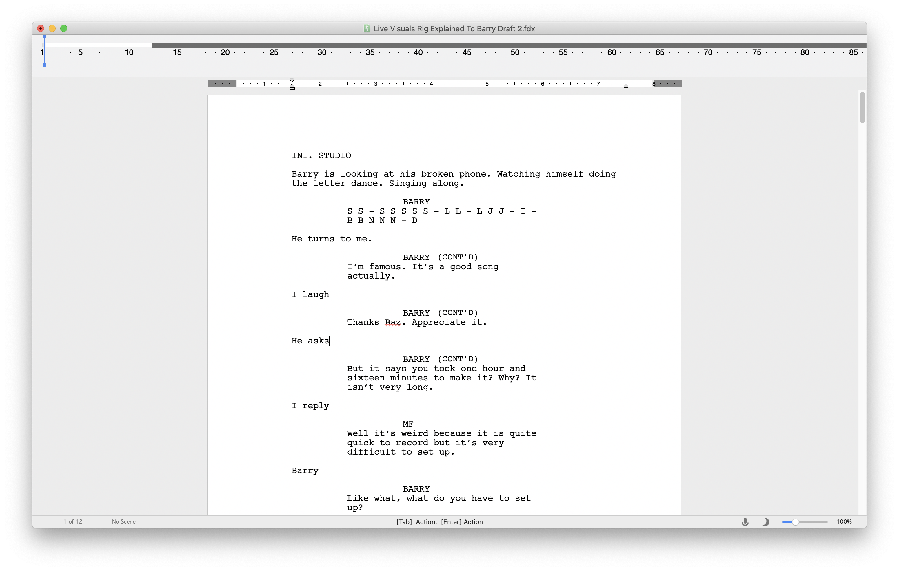
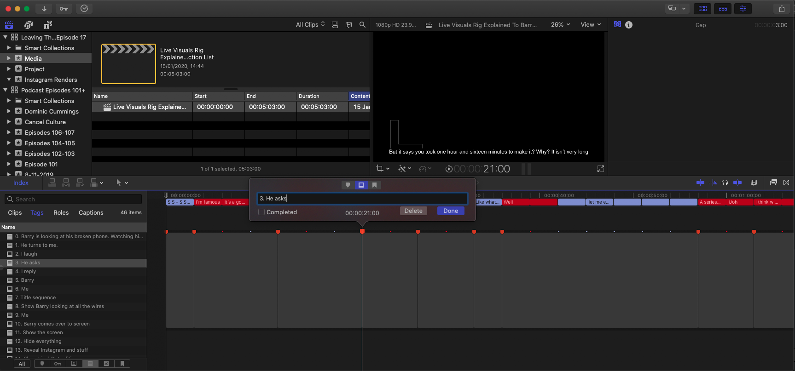

#  Shooting Checklist

This app does two things.

1. When you've finished a script in _Final Draft_ you can open it here and it will give you a checklist of scenes you need to shoot. It's what I used to make [this video](http://michaelforrestmusic.com/posts/da4768aa2931?filter=blog). This is the default view.

2. Convert a _Final Draft_ script into a _Final Cut Pro X_ timeline via the File -> Export menu item.

## Script to timeline conversion
A script should look something like this:

The result will be something like this:

The timeline includes
* A list of action segments broken up by dialog
* Each action has a numbered TODO marker containing the action description
* Dialogue is imported as captions

Then all you have to do is fill it in!

